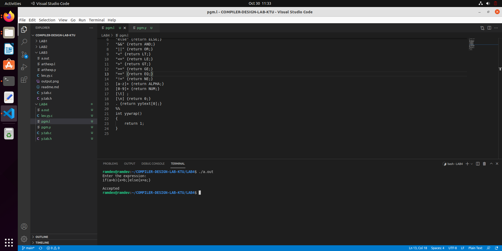

##STEPS TO REPRODUCE

install lex on your machine

sudo apt install flex

sudo apt install bison

ramdev@ramdev:~/COMPILER-DESIGN-LAB-KTU/LAB4$ lex pgm.l
ramdev@ramdev:~/COMPILER-DESIGN-LAB-KTU/LAB4$ yacc pgm.y
ramdev@ramdev:~/COMPILER-DESIGN-LAB-KTU/LAB4$ gcc lex.yy.c y.tab.c
ramdev@ramdev:~/COMPILER-DESIGN-LAB-KTU/LAB4$ ./a.out 

   

